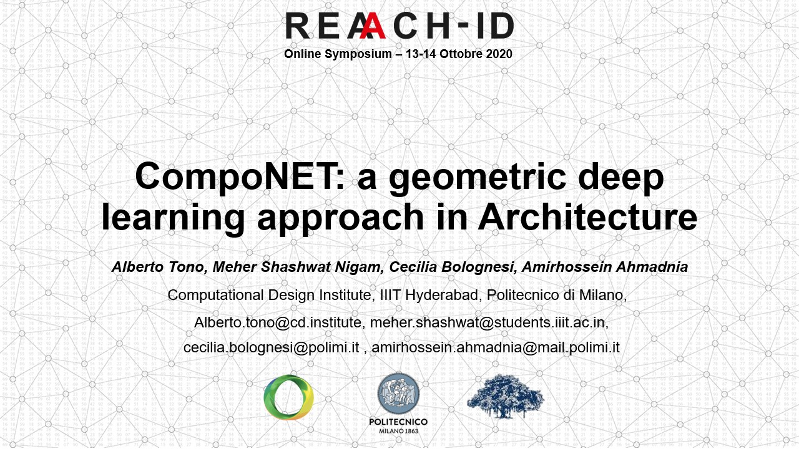
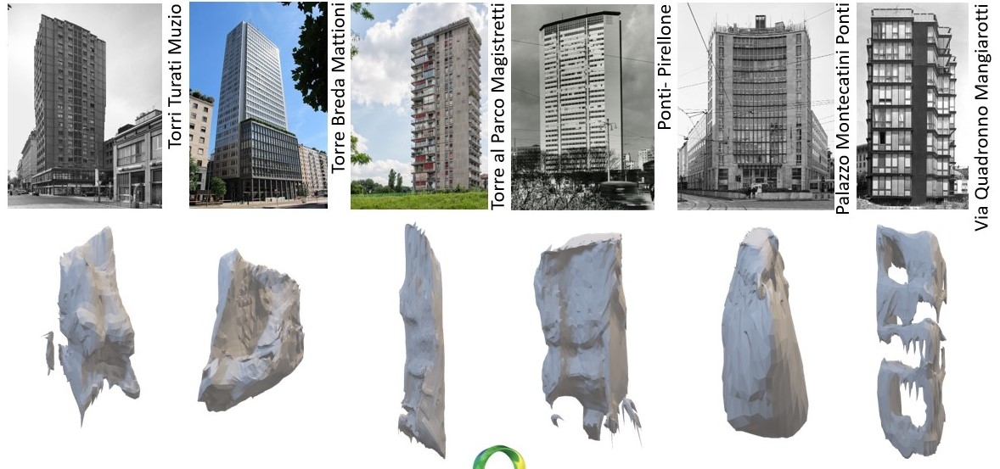

# CompoNET: a geometric deep learning approach in Architecture 

[](https://colab.research.google.com/drive/1W9A07851Tq3y_gXt9wM--vCk0US2CZ8G?usp=sharing)
## Authors
Alberto Tono, Cecilia Bolognesi, Amirhossein Ahmadnia, Meher Shashwat Nigam (2020) <br/>
<alberto.tono@cd.institute><br/>
<cecilia.bolognesi@polimi.it><br/>
<amirhossein.ahmadnia@mail.polimi.it><br/>
<meher.shashwat@students.iiit.ac.in><br/>

### Video
[](https://www.youtube.com/watch?v=IYhbSmMNbyU)


### Abstract
<div style="text-align: justify">Currently, we capture reality around us with static 2D media. For instance, architects represent their work with iconic pictures or renders, losing the sense of immersion provided by volumetric representations. Furthermore, when they perform surveys, they capture the environment with prone to errors, motionless pictures, and measurements, expensive laser scanners, or other methodologies. Today technologies aim to create a more immerse experience that can help in the long term to fill the gap between a 2d digital representation and the tridimensional physical space. Thanks to depth maps, stereo imagery and others it is possible to generate 3d objects from 2d media like video, panorama pictures, or 2d pictures. State-of-the-art algorithms are democratizing how we generate 3D objects from a multi-views or single view representation. These so-called 3D photos produce a more immersive representation. The multidisciplinary inherited advancement in these technologies will benefit not only architecture but also industries like robotics, augmented, and virtual reality, providing a better machine perception and a more immersive environment, generating geometrical representations of objects and spaces. Mesh-RCNN or procedural approaches produce 3D meshes by first identifying the objects in the image and then predicting coarse voxelized object which is further refined to produce meshes. In this paper, we tested and compared different approaches explaining their potential and current limitations in the Architectural Heritage of applying MeshRCNN, Occupancy Networks and other solutions into the wild. These AI-powered techniques can blend digital and reality in a much more democratic way without expensive and bulky HMDs. Furthermore, Pix2Pix and Generative Adversarial Network (GAN) already enable an image-to-image translation, from a sketch to render for artists and designers. Unifying these two techniques: image-to-image translation and picture to 3D, would be possible in the long run to avoid a “mongian” representation of reality, with perspective views and a perfect mathematical model of the space, but use a more heuristic and personalized representation of reality to generate 3d shapes. Designers will be allowed to use their sketches and their style to communicate and evaluate their ideas in a tridimensional space. This paper experiments with new functional differentiable rendering frameworks like Pytorch3D to explore 2d-3d neural networks. Moreover, working with 3d embedded semantics, hierarchical graph network, it could be possible to encode shapes into images and learning their 3d part assembly from a single image. For example, after taking a picture of a façade, it would be possible to recognize its part and regenerate a 3d model with windows and doors and their sub-part with associated information (BIM), semantic properties, and ontologies. Presently, the 2D proxies do not include this information, they are limited to pixel recognition, and most of the time, they miss parts within parts. Those two use cases are what differentiates a truly novel solution from the unending list of 2d-3d trained CNNs available. In this paper, an extensive review of state-of-the-art methods is presented to provide a better understanding of current limitations and opportunities specifically for architecture.</div>

<br/>
<br/>



```
@inproceedings{CompoNET,
    title = {CompoNET: Geometric Deep Learning in Architecture },
    author = {Alberto Tono, Meher Shashwat Nigam, Amirhossein Ahmadnia,Cecilia Bolognesi},
    booktitle = {Reaach-Id 2020},
    year = {2020}
}
```

References 
- https://github.com/nschor/CompoNet

