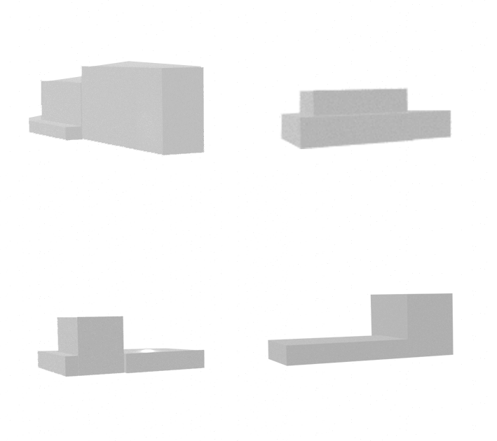
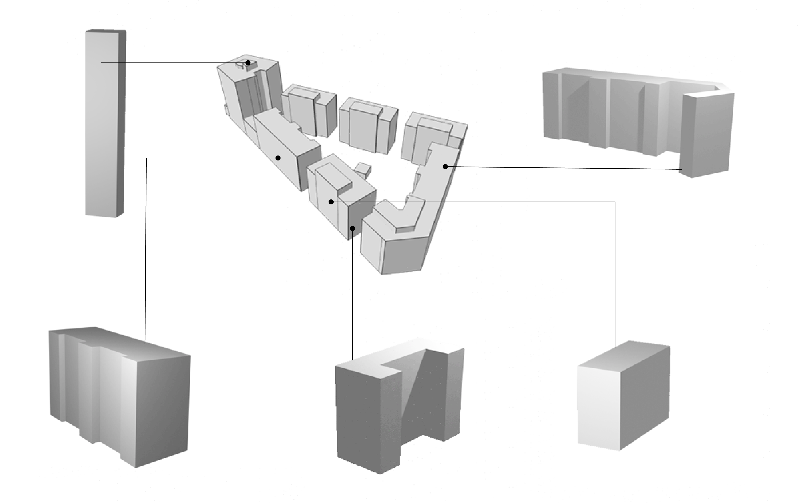

# Synthetic Dataset Generator

This is a tool that generates synthetic buildings of different typologies. To use it, first of all, you would need [Blender](https://www.blender.org/download/)>=2.90. After installation make sure to add blender as an Environment variable. To use the package:
```
git clone https://github.com/CDInstitute/CompoNET
```
Navigate to the ```dataset``` folder.

## Synthetic Buildings


To create completely synthetic buildings use:

```
blender setup.blend --python generaotr.py
```
if you want blender to act n background use:
```
blender --background setup.blend --python generaotr.py
```

Note:
if there are any specific parameters for your buildings (e.g. max and min height / width / length), you can provide them in ```config.py```. Default values adhere to international standards (min) and most common European values (max):

* minimum height 3m
* minimum length and width 6m
* maximum length, width, height 30 m

Make sure to adjust the camera in setup.blend if you choose different values.

## Buildings from existing .shp files:



Use provided .gltf (or your own) to create separate .obj files for each building in .gltf:
```
blender --background setup.blend --python shp2obj.py your_file.gltf
```
For now there is a manual process to convert shapefiles to .gltf format due to inaccuracies in Qgis2threejs library (will be fixed later):
* Load your .shp file into [QGis](https://www.qgis.org/en/site/)
* Indicate your height field as a z-dimension in ```Properties -> ```
* [Install](https://qgis2threejs.readthedocs.io/en/docs/Tutorial.html#install-the-plugin) Qgis2threejs plugin if you do not have it yet
* Select the buildings that interest you, make sure not to choose too many, as you might not have enough RAM
* ```Web -> Qgis2threejs -> choose your layer```
* ```Right click on the layer -> Properties -> height -> choose your height field```
* ```File -> Save Scene As -> .gltf```
